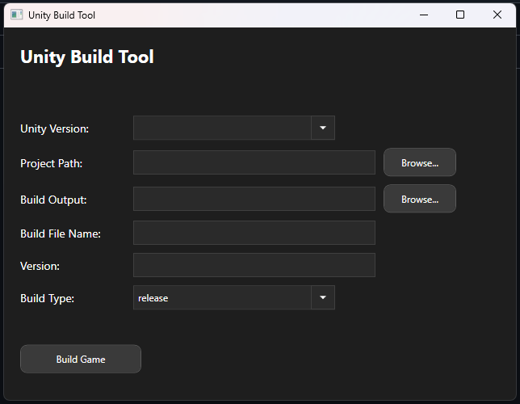

# 🧰 Unity Build Tool — Automated Game Builder (WPF)

A lightweight **desktop tool** that lets you build your Unity projects without opening the Unity Editor.  
Select your Unity version, project path, and output folder — then build your game with one click.  

Built in **C# / WPF**, designed for developers who want a faster, cleaner build workflow.

---

## 🚀 Features

- ✅ Detects all installed Unity versions (via Unity Hub)
- 🧩 Lets you select a Unity project path and build output folder
- ⚙️ Calls your custom Unity build script automatically
- 💬 Displays real-time build progress
- 🏗 Supports **automated builds** using Unity’s `-batchmode`
- 💡 Works standalone — no need to open Unity manually

---

## 🖥️ Preview

Example:

## Getting Started simple
1) Download UnityBuild.zip
2) Download BuildAutomation.cs
3) Drag BuildAutomation.cs into a folder called Editor -> Assets/Editor
4) Extract zip
5) double click exe and away you go

##Getting started 
1) Download whole project
2) Open in IDE of choice and make whatever changes you desire
3) Drag BuildAutomation.cs into a folder called Editor -> Assets/Editor
4) Build app in code editor or publish exe
5) Build game

